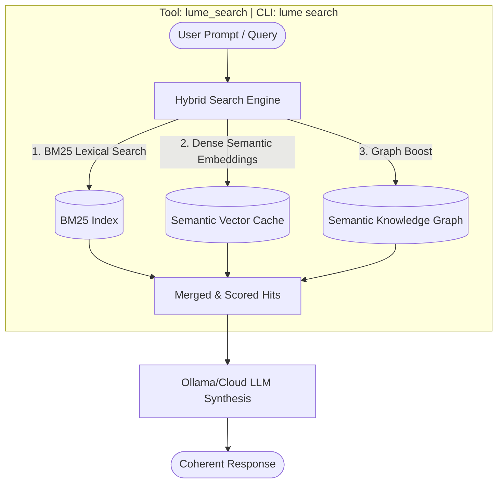
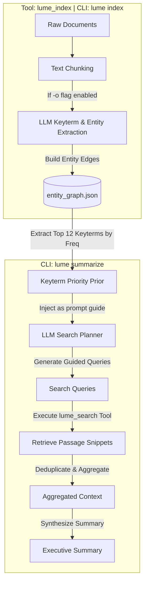
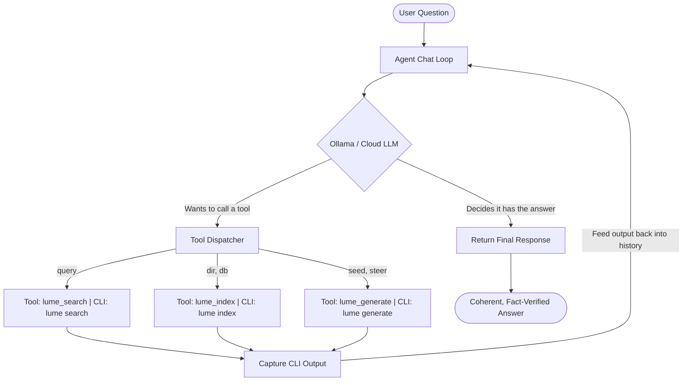

# Lume: Hybrid Search Engine & Agentic Document Memory

A high-performance Rust library and CLI suite featuring an FST-backed phrase matcher, hybrid lexical/semantic search engine, and agentic document exploration loop.

<div align="center">

[](https://github.com/jsclosures)
[](https://github.com/kordless)

</div>

---

## 🗺️ Table of Contents
*   [🚀 Installation & Quick Start](#installation)
*   [📐 Architecture & Core Components](#architecture)
*   [🛠️ CLI Subcommands & Tool Reference](#cli-reference)
    *   [1. Indexing (`lume index`)](#cli-index)
    *   [2. Searching (`lume search`)](#cli-search)
    *   [3. Generation (`lume generate`)](#cli-generate)
    *   [4. Graph-Guided Summarization (`lume summarize`)](#cli-summarize)
    *   [5. Autonomous Agent Chat Loop (`lume agent`)](#cli-agent)
    *   [6. Starting the MCP Server (`lume serve`)](#cli-serve)
    *   [7. Crawling Web Pages (`lume crawl`)](#cli-crawl)
    *   [8. Retrieval Evaluation (`lume eval`)](#cli-eval)
*   [⚡ Performance & Roadmap](#performance)
*   [🐍 Python Extractor & Q&A Generator](#python-extractor)
*   [💻 Codebase Indexing & Search Demo](#codebase-demo)
*   [📖 The Backstory: How Lume Connects](#backstory)
*   [💡 Acknowledgements & Inspiration](#acknowledgements)

---

## <a name="installation"></a>🚀 Installation & Quick Start

### Prerequisites
*   [Rust & Cargo](https://rustup.rs/) (v1.75+ recommended)
*   [Ollama](https://ollama.com/) running locally or accessible in your environment (defaults to using the cloud-backed model `gemma4:31b-cloud`).
*   [Python 3.10+](https://www.python.org/) with `requests` and `pypdf` installed (for PDF indexing/Q&A generation).

### Building the CLI
Build the release profile binary:
```bash
cargo build --release
```
The compiled binary will be located at `target/release/lume`.

---

## <a name="architecture"></a>📐 Architecture & Core Components

All capabilities of Lume are exposed to the autonomous agent as JSON RPC tools and map directly to CLI commands that a user can run manually to see the raw results.

### 1. Hybrid Search Architecture
This diagram represents the hybrid search pipeline executed by the `lume_search` tool:



### 2. Keyterm Extraction & Graph-Guided Summarization Architecture
This diagram shows how keyterms are extracted via `lume_index` and later used to guide query planning during document summarization:



### 3. Autonomous Agent Loop Architecture
This diagram represents the stateful tool-calling loop (`lume agent`) where the LLM plans and executes commands iteratively:



The system is organized into the following core Rust and Python modules:

*   **FST-Backed Phrase Tagger**: Performs longest-dominant-right matching using Lucene-style separator bytes. Built on [Tagger](src/lib.rs#L112) and [Entry](src/lib.rs#L45) in [src/lib.rs](src/lib.rs).
*   **Hybrid Search Engine**: Integrates BM25 lexical retrieval ([Bm25Index](src/bm25.rs)), spelling correction ([SpellIndex](src/spelling.rs)), and dense embeddings ([src/hybrid.rs](src/hybrid.rs)) with graph-steered query expansion ([src/graph_search.rs](src/graph_search.rs)) to boost matches based on Semantic Knowledge Graph connections.
*   **Semantic Knowledge Graph (SKG)**: The entity co-occurrence graph is **index-native** — built from pairwise roaring-bitmap intersections ("counting the counts") in [EntityGraph::build](src/semantic_mesh.rs), and consumed at query time as a live ranking *and recall* signal ([src/graph_search.rs](src/graph_search.rs)): query entities are resolved, the graph is walked one hop, and matching passages are boosted; strongly-related passages with *no* lexical hit are pulled in via recall expansion. Entity nodes come from either the local FST tagger (`--tag-dict`, fully deterministic) **or** optional LLM extraction (`-o`) — the graph math is identical either way. Edges carry both Jaccard overlap and a **significance** score (z-score of observed vs. expected co-occurrence), selectable via `--scoring`.
*   **Steered Markov Chain Synthesizer**: Under the hood, Lume uses a trigram [MarkovChain](src/semantic_mesh.rs#L129) to generate text. However, it goes beyond random walks by steering/biasing trigram transitions using FST tags, local attention feedback, and GTR-T5 semantic vector inversion ([src/inversion.rs](src/inversion.rs)).
*   **Agent & Summarization Engine**: Runs autonomous query planning, search exploration, and structured synthesis. Main entry points are [run_agent_loop](src/agent.rs#L731) and [summarize_document](src/agent.rs#L938) in [src/agent.rs](src/agent.rs). Supports failure recovery via [lume_not_found](src/agent.rs#L828).
*   **Model Context Protocol (MCP)**: Implements an MCP server over HTTP transport in [serve](src/agent.rs#L679) to expose indexing and search tools directly to AI agents.
*   **Python Document Extractor**: A high-efficiency parser ([lib/lume_extractor.py](lib/lume_extractor.py)) that handles PDF page text extraction and generates Q&A benchmark datasets using concurrent Ollama threads.

---

## <a name="cli-reference"></a>🛠️ CLI Subcommands & Tool Execution Reference

Each tool exposed to the agent maps to a CLI subcommand. A user can run these directly to see raw search hits, index logs, or Markov generated texts.

### <a name="cli-index"></a>1. `lume_index` Tool → `lume index` CLI Command
Indexes a directory containing text, markdown, or PDF files.
```bash
# Basic lexical indexing
./target/release/lume index docs/my_documents

# Semantic indexing with dense vectors (-s) and Ollama Entity Graph extraction (-o)
./target/release/lume index -s -o docs/my_documents
```
*   **Raw Output**: Prints file indexing progress, chunk counts, semantic cache updates, and entity extraction timings.
*   **Flags**:
    *   `-s, --semantic`: Enables dense vector search (requires a NUTS token).
    *   `-o, --ollama-entities`: Extract central entities and construct `entity_graph.json`.
    *   `-f, --force`: Forces re-indexing of all documents.
*   **Options**:
    *   `--db <PATH>`: Destination directory for the index metadata [default: `.lume-index`].
    *   `--ollama-model <MODEL>`: Ollama model for entity extraction [default: `gpt-4o-mini:latest`].
    *   `LUME_EXTRACT_WORKERS` (env): concurrent extraction threads [default: `10`] — lower it for local models bound by `OLLAMA_NUM_PARALLEL`.

---

### <a name="cli-search"></a>2. `lume_search` Tool → `lume search` CLI Command
Queries the persisted index using lexical (BM25) or hybrid search:
```bash
# Basic BM25 search
./target/release/lume search "Edmond Dantes"

# Hybrid search (weighting: 0.5 BM25, 0.5 vector semantic) with spelling correction (-c)
./target/release/lume search -c -a 0.5 "Edmond Dantes"
```
*   **Raw Output**: Prints raw retrieved document passages accompanied by match scores (BM25 + Semantic + SKG Boost).
*   **Options**:
    *   `-a, --alpha <VAL>`: Hybrid weight. `0.0` is lexical-only; `1.0` is semantic-only [default: `0.5`].
    *   `-g, --graph <VAL>`: Entity graph boost weight [default: `0.4`]. Enables **graph-steered expansion**: Lume resolves entities in the query, walks one hop to their strongest neighbors in `entity_graph.json`, and boosts matching passage scores by the related-entity mass. Set `0` to disable.
    *   `--scoring <MODE>`: How SKG edges are weighted when walking the graph. `relatedness` (default) uses **statistical significance** — observed co-occurrence vs. what chance predicts (`expected = |A||B|/N`), so promiscuous hub entities that co-occur with everything are damped and only genuine associations boost. `jaccard` uses raw overlap `|A∩B| / |A∪B|`. Both are computed directly from the roaring-bitmap intersection counts (no extra scan). See [src/semantic_mesh.rs](src/semantic_mesh.rs) (`cooccurrence_relatedness`) and [src/graph_search.rs](src/graph_search.rs).
    *   `-l, --limit <LIMIT>`: Maximum search hits [default: `10`].

---

### <a name="cli-generate"></a>3. `lume_generate` Tool → `lume generate` CLI Command
Synthesizes style-faithful text based on the indexed corpus using a trigram Markov Chain:
```bash
# Generate styled text starting with Dantes and guided by concept keywords
./target/release/lume generate "Dantes" --steer "revenge,castle"
```
*   **Raw Output**: Prints a block of synthesized text in the style of the indexed corpus.
*   **Modes**:
    *   **Tag-Steered Mode**: Biases transitions towards the `--steer` tags using co-occurrence weights from the index's posting lists.
    *   **Vector-Steered Inversion Mode**: Automatically embeds the target seed, inverts it into its closest semantic tags, and runs multiple candidate generation rounds to find the closest cosine-similarity match to the target prompt.

---

### <a name="cli-summarize"></a>4. Graph-Guided Summarization (`lume summarize` Command)
Summarize an entire document using an agentic planning-and-retrieval loop guided by the highest-ranking nodes in the Semantic Knowledge Graph:
```bash
./target/release/lume summarize docs/my_documents/book.pdf
```
*   **How it works**:
    1. Reads `entity_graph.json` to identify the top 12 central concepts.
    2. Passes these concepts as priors to the Ollama model.
    3. Plans a series of distinct search queries targeting the key concepts.
    4. Executes queries, aggregates unique passages, and synthesizes a high-level executive summary.

---

### <a name="cli-agent"></a>5. Autonomous Agent Chat Loop (`lume agent` Command)
Spawn an autonomous agent to research and resolve a complex question by executing indexing and search tools iteratively:
```bash
./target/release/lume agent "Explain the relationship between Villefort and Mercedes"
```
*   **Structured Failure Recovery**: If the agent's searches do not yield the required information, it calls a dedicated `lume_not_found` tool. The system then provides structured guidance prompting the agent to refine its query keywords or search broad/narrow variations, preventing premature halts or false answers.

---

### <a name="cli-serve"></a>6. Starting the MCP Server (`lume serve` Command)
Start the Model Context Protocol HTTP server to connect Lume to external AI agents:
```bash
./target/release/lume serve --port 8080
```

---

### <a name="cli-crawl"></a>7. Crawling Web Pages (`lume crawl` Command)
Crawls a target website to extract its text/markdown representation and saves the file to the local personal search engine directory (`examples/crawled/`):
```bash
# Crawl a webpage
./target/release/lume crawl https://example.com

# Crawl a Hacker News story
./target/release/lume crawl https://news.ycombinator.com/item?id=8863
```
*   **How it works**:
    *   **Local Crawling (Tokenless)**: If `GRUB_BASE_URL` is set to a local endpoint (such as `http://localhost:6792` or when running locally), Lume connects to the local Grub instance and crawls without requiring any authentication or `NUTS_SERVICES_TOKEN`.
    *   **Remote Crawling (Authenticated)**: If `GRUB_BASE_URL` points to a remote endpoint (e.g. `grub.nuts.services`), Lume uses the `NUTS_SERVICES_TOKEN` environment variable to authenticate. If the token is missing, it falls back to direct HTTP GET (no JavaScript execution).
    *   **Hacker News Special Handling**: If a Hacker News story URL is detected, Lume queries the public HN Firebase API to retrieve both the story post and its top-level discussion comments, assembling them into a clean Markdown file.

---

### <a name="cli-eval"></a>8. Retrieval Evaluation (`lume eval` Command)
Measure retrieval quality against a Q&A file — the discipline that turns "it returns sensible results" into numbers:
```bash
# Index a corpus with a local entity dictionary (deterministic SKG, no LLM)
./target/release/lume index --db .lume-eval-index --tag-dict dict/characters.csv docs/monte_cristo

# Score Hit@k / MRR / nDCG@k, comparing the two SKG edge-scoring modes
./target/release/lume eval --db .lume-eval-index --compare docs/monte_cristo/qna.json
```
*   **How it works**: Relevance is judged by **answer-token containment** (no human labels required): a retrieved section counts as relevant when it contains at least `--threshold` of the answer's content tokens. This needs no alignment between the extractor's chunking and the index's sectioning. Implemented in [src/eval.rs](src/eval.rs).
*   **Options**: `--db`, `-k/--limit` (cut-off for Hit@k/nDCG@k), `-g/--graph` (graph boost weight), `--scoring` (`relatedness` vs `jaccard`), `-t/--threshold` (relevance cut-off [default `0.5`]), `-n/--max-questions`, `--compare` (run both scoring modes and print the delta).
*   **Honest example output** (Count of Monte Cristo, 1,926 sections, 373 questions): lexical BM25 lands **Hit@10 ≈ 90%** on factual single-fact questions — already near the ceiling, so the graph boost is roughly neutral here (its value is associative/exploratory queries and recall, not factoid lookup). The harness exists to *surface* exactly that kind of result, including when a feature doesn't help.

---

## <a name="performance"></a>⚡ Performance & Roadmap

Lume is written in Rust (zero-dependency core: `tantivy-fst`, `serde`, `ureq`) and built for speed on real corpora — measured, not aspirational:

*   **Indexing**: a complex codebase indexes in a few seconds; a 2.8 MB novel chunks into ~1,900 sections and is searchable in **under a second** (lexical). Dense semantic ingest of ~450 chunks via local Shivvr completes in ~8s.
*   **Search**: lexical BM25 retrieval is **microsecond-class** at the core — two-stage roaring-bitmap pruning runs in ~10 µs on these corpora — with full lexical queries sub-millisecond. Hybrid queries add a dense round-trip (milliseconds), and the SKG significance boost is free arithmetic on counts the roaring intersection already produced.
*   **Vector inversion**: a cutting-edge technique — embed text to its 768-d GTR-T5 vector, then **reconstruct text back from the raw vector** via Shivvr's `/invert` endpoint (round-trips at ~0.88 self-similarity locally). Used by the inversion-steered generator ([src/inversion.rs](src/inversion.rs)) to hill-climb candidates toward a target in embedding space — fully local, no token needed.
*   **Roadmap**: on-the-fly fine-tuning of open embedding models (GTE and others) so the semantic space adapts to your corpus, rather than relying on a fixed GTR-T5 encoder.

---

## <a name="python-extractor"></a>🐍 Python Extractor & Q&A Generator

Located at [lib/lume_extractor.py](lib/lume_extractor.py), this tool can extract text and generate Q&A evaluation datasets from document chunks:

```bash
# Extract text from a PDF
python lib/lume_extractor.py pdf my_doc.pdf

# Generate a Q&A evaluation benchmark using Ollama
python lib/lume_extractor.py qna my_doc.txt output_qna.json --model gemma4:31b-cloud
```

---

## <a name="codebase-demo"></a>💻 Codebase Indexing & Search Demo

Lume can index and search programming code repositories (like Lume's own Rust source files).

### 1. Indexing the Codebase
Index the `src/` directory containing Lume's Rust modules into a separate index database folder:
```bash
./target/release/lume index --db .lume-code-index src
```

### 2. Searching the Codebase for a Symbol
Query the code index for the `run_agent_loop` function to find raw code definitions:
```bash
./target/release/lume search --db .lume-code-index "run_agent_loop"
```

### Example Raw Output
```text
[1] Score: 8.4109 | Lines 700-725 (File: src/agent.rs, Line: 703)
pub fn run_agent_loop(
    question: &str,
    ollama_url: &str,
    ollama_model: &str,
    db_dir: &str,
    verbose: bool,
) -> Result<(), String> {
    let url = format!("{}/api/chat", ollama_url.trim_end_matches('/'));
```

---

## <a name="backstory"></a>📖 The Backstory: How Lume Connects

Lume is the story of ideas moving from one person to another—a search meme carried through years of crawling systems, open-source heritage, industrial search consulting, and modern AI capability.

### 🐧 The Seed: It Began with Crawling (Grub)
It all started with web crawling. Back in the early days of distributed search, [Kord Campbell](https://github.com/kordless) created **Grub**—a massively distributed web crawler. After installing Lucene and thinking about how to search all that data, Kord sent an email to Eric Schmidt (then-CEO of Google), saying: *"Hey, I've got this super fast distributed crawler."* Schmidt replied with a classic search insight: *"That's not the problem. We've got crawling figured out. Indexing is the challenge."*

Decades later, that conversation has come full circle. In the age of AI, **crawling is everything again**. To feed frontier LLMs, you have to crawl to get the content, and you need a crawler that you can control. 

But once you crawl it, where do you put it? 

### 🧠 The Memory Challenge
You can't crawl the web fresh every single time you need an answer. Web pages are a type of document memory. Unlike bot or conversational memory (like an LLM remembering that a user's parrot is blue), document memory is about capturing the precise text you just saw. Some of these pages never update, while others update every minute. You need a dedicated, extremely fast local document store to hold and index this memory.

That's when the pieces fell into place. Kord was watching LinkedIn and saw [Steve Harris](https://github.com/jsclosures) post about porting his zero-dependency JavaScript FST tagger to Rust (released as [rust-fstguardrails](https://github.com/jsclosures/rust-fstguardrails)). Steve had run [Portaltown](https://www.portaltown.com), a search consultancy, and had worked for **Lucidworks**. His background as a U.S. Marine Corps air traffic controller deeply influenced how he designed systems: a focus on safety, extreme precision, and bare-metal performance. 

Kord saw Steve's post and realized: *"That FST tagger is the first part of our document index."*

### 💡 Credit for the "Aha" Moments
To turn that FST tagger into a complete, lightweight search engine, Kord drew on years of shared search history. During his time consulting at **Lucidworks**, Kord had met OG search veterans [Trey Grainger](https://github.com/treygrainger) and [Erik Hatcher](https://github.com/erikhatcher). 

Trey's work on Solr's **Semantic Knowledge Graph (SKG)** had always stuck with Kord. The concept seemed complex, but Erik Hatcher had delivered the ultimate "aha" moment by putting it simply: 
> *Facets are just counts of the occurrences of something in a document. The Knowledge Graph is simply looking at those counts across all documents to perform document intersections. It is just counting the counts of things.*

That was the magic of Erik Hatcher—he has always had the unique gift of taking complex technology and showing everyone how it actually works under the hood. (We throw affectionate shade at Trey for making it look complicated, and at Erik for making it look too simple!)

Understanding that primitive meant realizing a high-speed search engine didn't need millions of lines of code. It just needed to do simple things incredibly fast: FSTs for words, roaring bitmaps for set intersections, spell correction for misspellings, and additive hybrid boosting for vector context.

This hybrid design philosophy aligns with the pioneering search relevance and education work championed by [Doug Turnbull](https://softwaredoug.com/), demonstrating that combining precise keyword matching, semantic embeddings, and structural graphs yields a far more reliable context for agentic search than simple vector retrieval.

### 🚀 The AI pair-programming
Working in a continuous human-AI feedback loop, Lume's core and extended capabilities (like its stateful agent loops, MCP servers, and HTML/markdown crawling module) were constructed using state-of-the-art AI coding assistants (like Google's pair-programmer Antigravity). This collaborative process directly addresses the [AI Slop Effort Problem](https://deepbluedynamics.com/blog/ai-slop-effort-problem): AI-generated code is not bad by default if it is carefully annealed, iterated, and fact-checked; what is sloppy is the quick, dismissive use of the term "slop" by software engineers who have yet to throw themselves into the deep end of human-AI pair programming. 

---

## <a name="acknowledgements"></a>💡 Acknowledgements & Inspiration

Lume was inspired by the foundational FST-based tagging work in [jsclosures/rust-fstguardrails](https://github.com/jsclosures/rust-fstguardrails).
